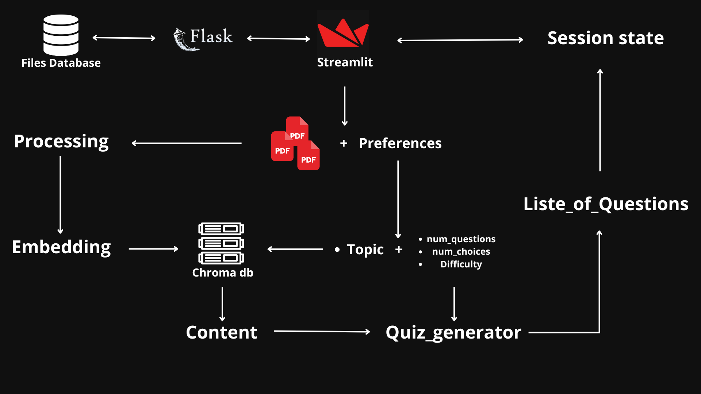

# PDF Quiz Generator Powered by Streamlit and Vector Databases

Welcome to the **PDF Quiz Generator**, a versatile application designed to create quizzes based on PDF content. Users can upload PDFs and specify a topic and number of questions to generate a customized quiz. The application stores uploaded files and generated quizzes for future access. This project utilizes **Streamlit** for the user interface and **Flask** for backend storage, integrating **Vector Databases** for efficient search and retrieval.



## Features

- **Streamlit Interface**: An intuitive and interactive user interface for quiz generation.
- **PDF Upload**: Allows users to upload PDF files as sources for quiz content.
- **Customizable Quizzes**: Generate quizzes by specifying the topic and number of questions.
- **Vector Database Integration**: Efficiently searches and retrieves information from PDFs using vector databases.
- **File Storage**: Stores uploaded PDFs and generated quizzes for future access.
- **Quiz Timer**: Implements a timer for each question to enhance the quiz experience.

## Getting Started

Follow these instructions to set up and run the project locally.

### Prerequisites

Ensure you have the following installed:

- Python 3.8 or higher
- Pip (Python package installer)

### Installation

1. **Clone the Repository**

   ```bash
   git clone https://github.com/AmineRaouane/PDF-QUIZ.git
